# 🎓 Online Coaching Management System

<div align="center">


**A comprehensive full-stack online coaching platform built with modern technologies**

[⭐ Star](https://github.com/shaileshkole16/Online_Coaching) · [🐛 Report Bug](https://github.com/shaileshkole16/Online_Coaching/issues) · [📝 Request Feature](https://github.com/shaileshkole16/Online_Coaching/issues)

</div>

---

## 📋 Overview

This is a complete Learning Management System (LMS) designed for educational institutions, featuring role-based access control for Admins, Teachers, and Students. The platform provides comprehensive tools for course management, content delivery, assessments, and progress tracking.

### ✨ Key Highlights

- 🔐 **Secure Authentication** with JWT tokens
- 👥 **Role-Based Access Control** (Admin, Teacher, Student)
- 📚 **Comprehensive Course Management** with lectures, quizzes, and assignments
- 💬 **Interactive Features** including discussion forums and AI chat
- 📊 **Analytics & Reporting** for insights and progress tracking
- 🎨 **Modern UI** built with React and TailwindCSS

## 🚀 Implemented Features

### 🔧 Backend (Spring Boot)

| Feature | Description |
|---------|-------------|
| 🔐 Authentication & Authorization | JWT-based secure authentication |
| 👥 User Management | Admin, Teacher, Student roles |
| 📚 Course Management | Create, edit, manage courses |
| 🎥 Lecture Management | Video lectures with progress tracking |
| 📝 Quiz System | Create and manage quizzes |
| 📋 Assignment System | Assignment creation and submission |
| 📤 File Upload | Support for file uploads |
| 💬 Discussion Forums | Course discussions and Q&A |
| 📊 Results & Grading | Grade management and result viewing |
| 🎫 Support Tickets | Ticket management system |
| 📜 Audit Logging | Complete audit trail |
| 🤖 AI Chat Integration | AI-powered assistance |

### 🎨 Frontend (React)

| Feature | Description |
|---------|-------------|
| 🔐 User Authentication | Login, Register, Password Reset |
| 📊 Admin Dashboard | Analytics, Audit Logs, Ticket Management |
| 👨‍🏫 Teacher Dashboard | Profile, Discussion Forum, Course Ratings |
| 👨‍🎓 Student Dashboard | Profile, Progress, Support Tickets |
| 📚 Course Management | Catalog, Details, Creation, Editing, Ratings |
| 🎥 Lecture Management | Video playback with progress tracking |
| 📝 Quiz System | Quiz taking, submissions, grading |
| 📋 Assignment System | Assignment submission and grading |
| 💬 Discussion Forums | Interactive course discussions |
| 🎫 Support Tickets | Create and manage support tickets |
| 🤖 AI Chat Interface | AI-powered conversation assistant |
| 📖 Study Materials | Upload and manage course materials |
| 📊 Results & Grading | View results and manage grades |

### 🗄️ Database

- **MySQL** with **Flyway** migrations for version control

## 📁 Project Structure

```
online_coaching/
├── online-coaching-system/      # Spring Boot Backend
│   ├── src/main/java/com/coaching/
│   │   ├── controller/         # REST API controllers
│   │   ├── service/            # Business logic
│   │   ├── repository/         # Data access layer
│   │   ├── model/              # Entity models
│   │   └── config/             # Configuration classes
│   └── pom.xml                 # Maven dependencies
├── online-coaching-frontend/    # React Frontend
│   ├── src/
│   │   ├── components/         # Reusable components
│   │   ├── contexts/           # React contexts (Auth, etc.)
│   │   ├── pages/              # Page components
│   │   │   ├── admin/         # Admin pages
│   │   │   ├── student/       # Student pages
│   │   │   ├── teacher/       # Teacher pages
│   │   │   ├── auth/          # Authentication pages
│   │   │   ├── courses/       # Course pages
│   │   │   ├── assignments/   # Assignment pages
│   │   │   ├── quizzes/       # Quiz pages
│   │   │   ├── materials/     # Study materials pages
│   │   │   ├── results/       # Results pages
│   │   │   ├── submissions/   # Submission pages
│   │   │   └── ai/            # AI Chat pages
│   │   ├── services/           # API services
│   │   └── App.jsx            # Main app component
│   └── package.json            # NPM dependencies
└── README.md                   # This file
```

## 🛠️ Tech Stack

### 🔧 Backend

| Technology | Purpose |
|------------|---------|
|  | Programming Language |
|  | Application Framework |
|  | Authentication & Authorization |
|  | Database ORM |
|  | Database |
|  | Database Migration |

### 🎨 Frontend

| Technology | Purpose |
|------------|---------|
|  | UI Framework |
|  | Build Tool |
|  | Client-side Routing |
|  | API Client |
|  | CSS Framework |
|  | Icon Library |

## 🚀 Getting Started

### 📋 Prerequisites

-  Java 17 or higher
-  Node.js 16 or higher
-  MySQL 8.0 or higher
-  Maven (for backend)

### 🔧 Backend Setup

1. Navigate to backend directory:
   ```bash
   cd online-coaching-system
   ```

2. Configure database in `application.properties`:
   ```properties
   spring.datasource.url=jdbc:mysql://localhost:3306/online_coaching
   spring.datasource.username=your_username
   spring.datasource.password=your_password
   ```

3. Run the application:
   ```bash
   ./mvnw spring-boot:run
   ```
   Or on Windows:
   ```bash
   mvnw.cmd spring-boot:run
   ```

The backend will start on `http://localhost:8080` 🚀

### 🎨 Frontend Setup

1. Navigate to frontend directory:
   ```bash
   cd online-coaching-frontend
   ```

2. Install dependencies:
   ```bash
   npm install
   ```

3. Start the development server:
   ```bash
   npm run dev
   ```

The frontend will start on `http://localhost:3000` 🎨

## 📡 API Documentation

The backend provides RESTful APIs for all features. Key endpoints include:

| Endpoint | Description |
|----------|-------------|
| `/api/auth/*` | Authentication endpoints |
| `/api/admin/*` | Admin management |
| `/api/courses/*` | Course management |
| `/api/lectures/*` | Lecture management |
| `/api/assignments/*` | Assignment management |
| `/api/quiz/*` | Quiz management |
| `/api/ai/*` | AI Chat integration |

## 👤 Default Users

After running the database migrations, default users are created:

| Role | Email | Password |
|------|-------|----------|
| 👨‍💼 Admin | admin@coaching.com | admin123 |
| 👨‍🏫 Teacher | teacher@coaching.com | teacher123 |
| 👨‍🎓 Student | student@coaching.com | student123 |

## 📸 Screenshots

### 👨‍🎓 Student Dashboard
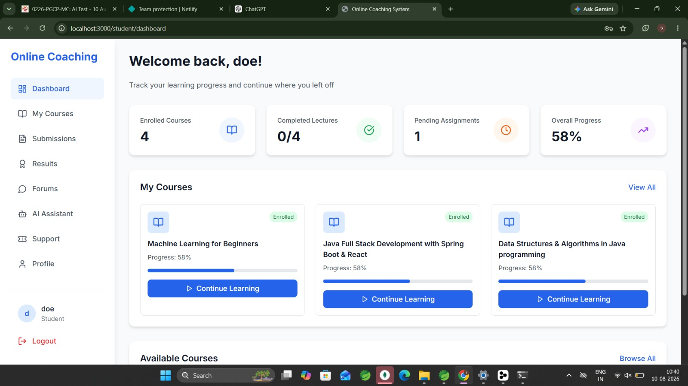

### 👨‍💼 Admin Dashboard
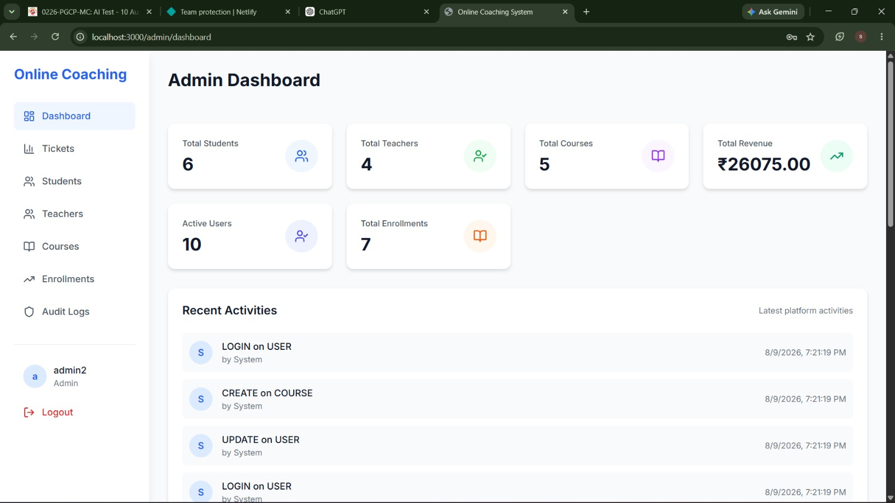

### 📜 Admin Audit Logs
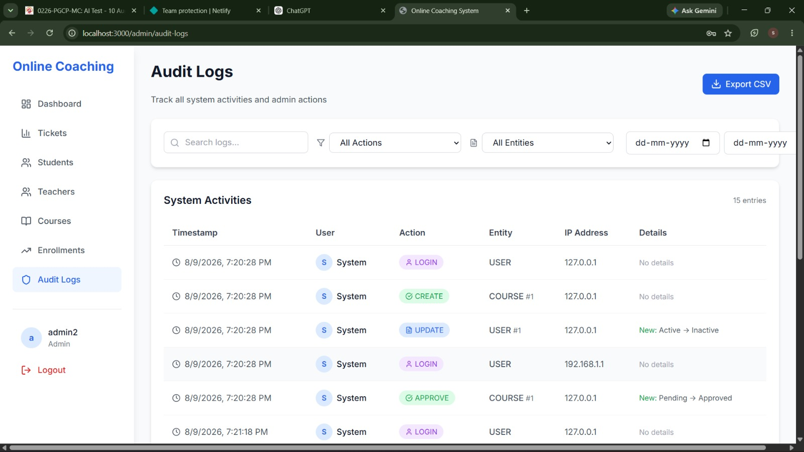

### 👨‍🏫 Admin Manage Teachers
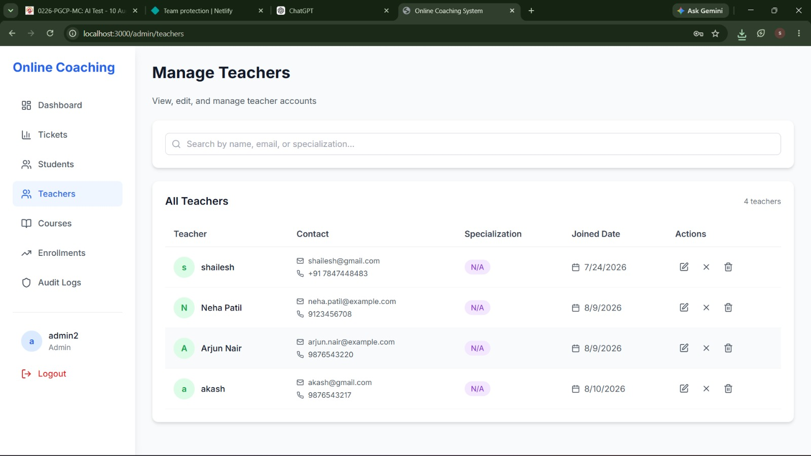

### 👨‍🎓 Admin Manage Students
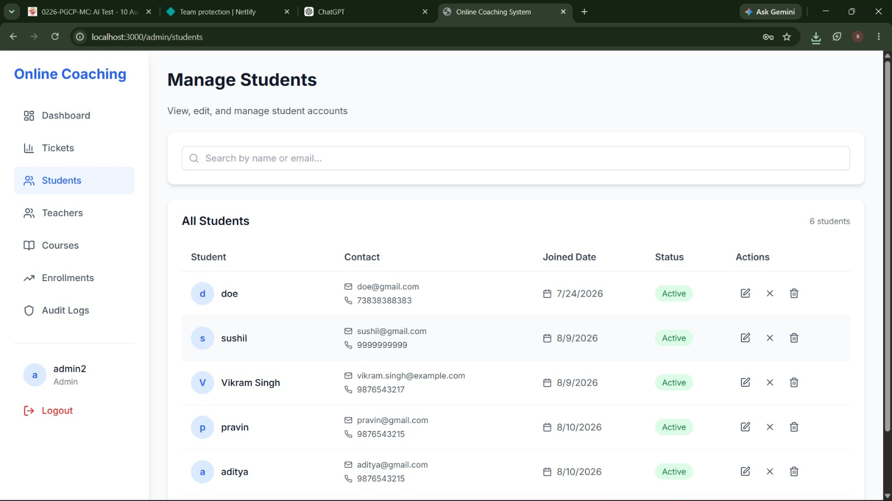

### 🎫 Admin Support Tickets
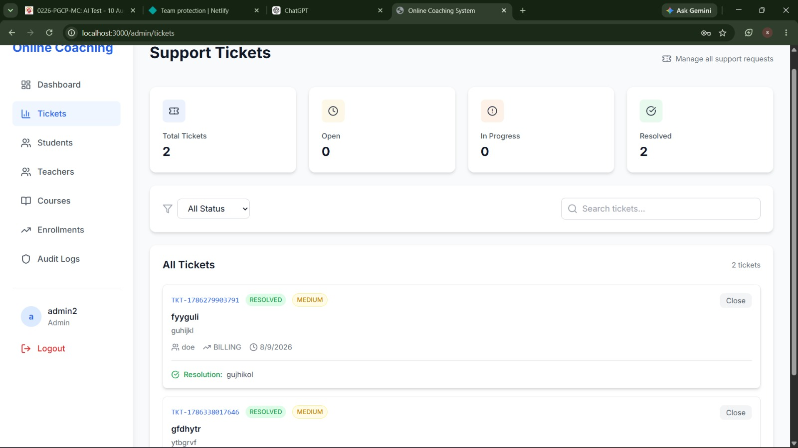

### 💬 Teacher Discussion Forum
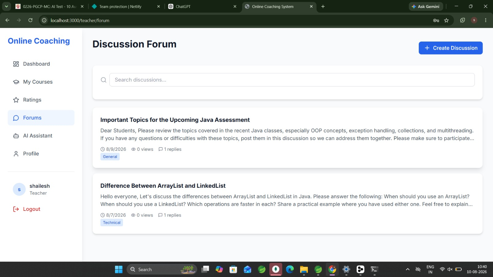

### ⭐ Teacher Ratings
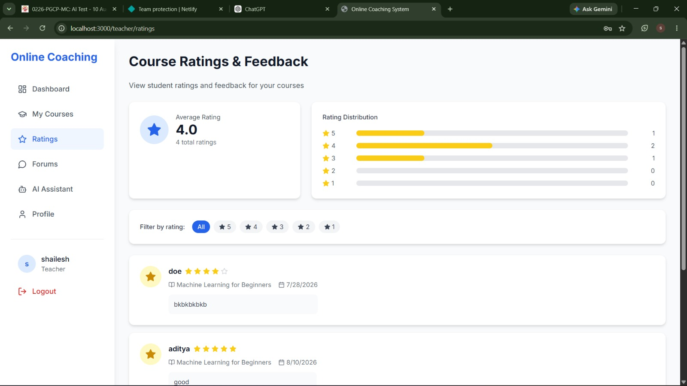

### 🤖 AI Chat Bot
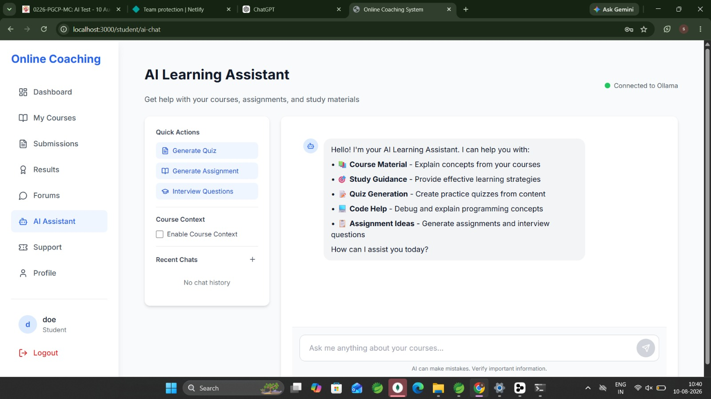

### 🔐 Sign In
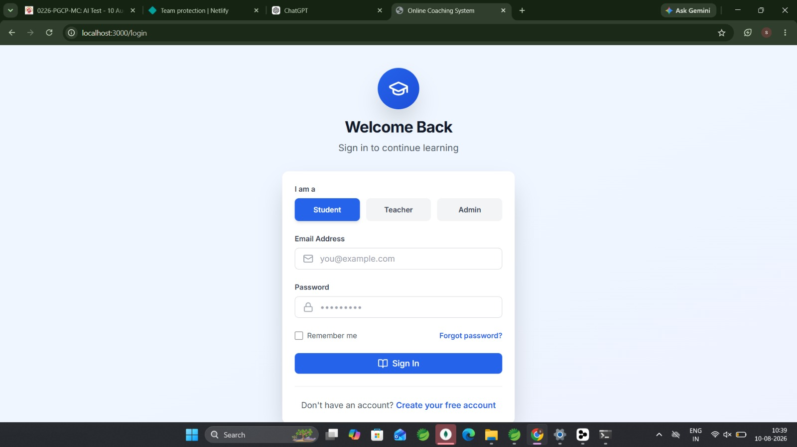

### 📝 Register
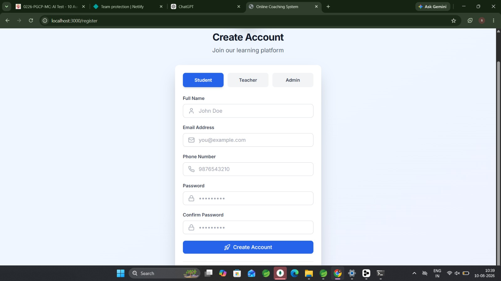

## 📄 License

This project is created for educational purposes.

---

<div align="center">

**Built with ❤️ by [Shailesh Kole](https://github.com/shaileshkole16)**

[⬆ Back to Top](#-online-coaching-management-system)

</div>
